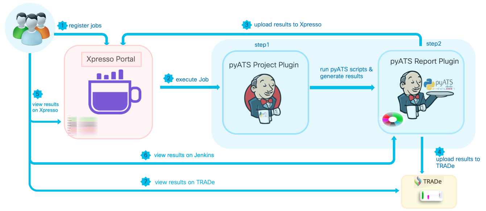
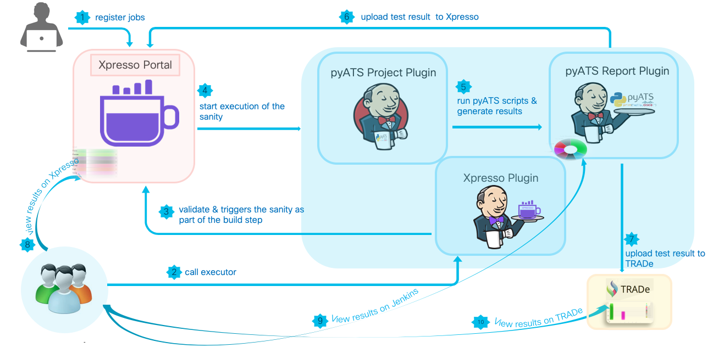

# pyATS Project Plugin 

This plugin enables seamless execution of [pyATS](https://developer.cisco.com/site/pyats/)
jobs within Jenkins, with native UI support for various pyATS command line arguments, etc.

## Table Of Content
- [Feature Highlights](#feature-highlights)
- [Workflow](#workflow-diagram)
- [Installation](guide/installation.md)
- [Quick Start](guide/quick_start.md)
- [Environment Configuration](guide/environment.md)
- [Configuring Parameters](guide/parameters.md)
- [Running in Docker](guide/docker.md)
- [Auto-provision File](guide/auto_provision.md)
- [REST API Support](guide/rest.md)
- [Related Plugins](guide/related.md)

## Related pyATS Plugins
- [pyATS Jenkins Report Plugin](https://github.com/CiscoTestAutomation/jenkins_report_plugin)
- [Xpresso Plugin](https://github.com/CiscoTestAutomation/jenkins_executor_plugin)

## Feature Highlights
* Running one or more pyATS Jobs
  * on local hosts
  * on Jenkins remote node(s) / slave(s)
  * in Docker containers - pulling & running pyATS source code/docker image
* Runtime overwriting Easypy job parameters
* Email generation upon run completion with result of the run
* Project auto provisioning (via yaml file)
* Interface with pyATS Report plugin for log viewing and uploading to Cisco Xpresso portal.

## Workflow Diagram

#### Using Project plugin, Report plugin, and viewing logs in Cisco Xpresso dashboard:

#### Using Xpresso plugin to kick off builds, and going through Xpresso dashboard:

## ChangeLog

* [2018](changelog/2018/CHANGELOG.md)
* [2019](changelog/2019/CHANGELOG.md)