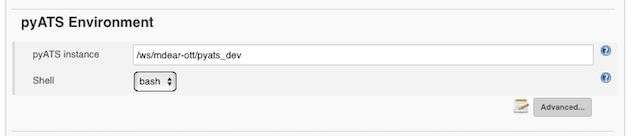
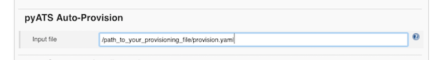
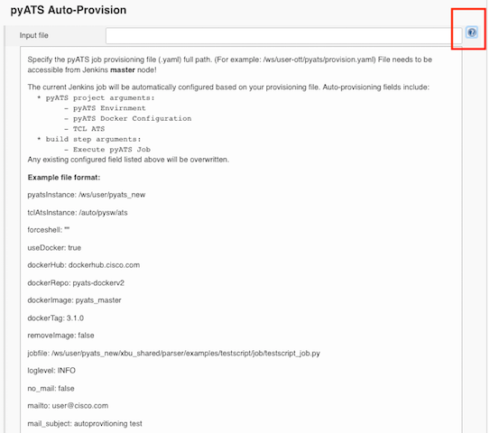
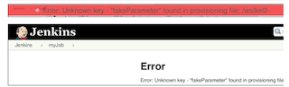

### Auto Provisioning

On the project configuration page, click "Advanced..." in **pyATS environment** section to bring out the auto provisioning configuration.

This feature enables configuring the pyATS jobs through a input file of _yaml_ format. The file location needs to be accessible by current Jenkins running node (Master). The pyATS parameters and values provided in the _yaml_ file will overwrite the values which maybe configured for the given attributes, any other parameters that are not part of the _yaml_ file will remain unchanged.

Details on the parameters, and their values can be found with the help (**?**) icon.

A form error will be generated when invalid _yaml_ format or incorrect parameters is encountered during loading of the _yaml_ file.

