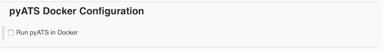
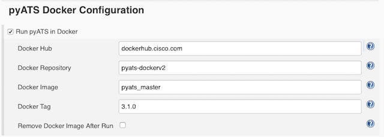

# Running in Docker

Optionally, you can also run a pyATS job inside a pyATS _Docker_ container, using an image
based from [CiscoTestAutomation/pyATS](https://hub.docker.com/r/ciscotestautomation/pyats/).

To do so, click "Advanced..." in **pyATS environment** section and enable running pyATS tests inside a Docker container.

Check the option - __Run pyATS in Docker__, provide the required information. Click the help (**?**) to see the detail explanation for each field.

Steps taken by the plugin when running pyATS in Docker:

* Pull the Docker image from a dockerhub specified
* Run a pyATS Easypy job within the Docker container
* Close and remove Docker container
* Remove the Docker image if user chooses to

