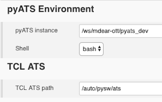
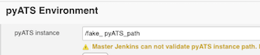
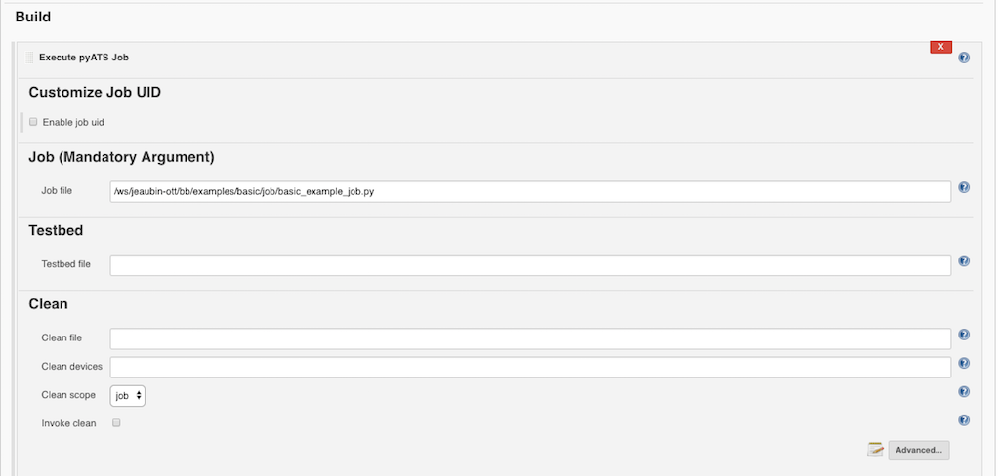
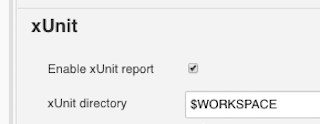

# Environment Configuration

This section allows user to configure pyATS project running environment. 

* The "pyATS instance" is the full path to the pyATS virtual environment. The path should be pyATS virtual instance location which can find the environment source file (activate/activate.csh) underneath, for example: _path/bin/activate_.
* The "shell" drop down menu allows user to switch the running shell environment between _bash_ and _cshell_.
* The "TCL ATS path" is the full path to the TCL ATS tree location which expect to find environment source file (env.sh/env.csh) underneath. 

If "Run pyATS in Docker" option is selected, the path validation (pyATS instance and TCL ATS path) will be disabled due to possible inaccessibility between Jenkins server and docker environment. A warning reminds the user that it's the user's responsibility to make sure the path are correct in this situation. Otherwise all the paths provided will be validated.

## Execute pyATS Job as Build Step

The "Execute pyATS Job" is the main functionality of pyATS project plugin. It adds pyATS jobs into Jenkins automation pipeline. User configures all the _easypy_ parameters via this component. To add this component, click "Add build step" and choose "Execute pyATS Job". Each Configurable field has its own help (__?__) for user to refer the usage. Self-validation also applicable on each field that warns user in most fallacious situation. 

Further explanation of some most used parameters (click "advance..." button to see the complete parameter list):

* Enable job uid - a unique ID associated with each job run (build). Jenkins *BUILD_TAG* (string of **jenkins-<JOB_NAME>-<BUILD_NUMBER>**) will be used as default value to make sure its uniqueness. It is user's responsibility to make sure it is a valid unique ID when enable the job uid and specify its own value.
* Job file - mandatory parameter for each pyATS job
* Testbed file - optional pyATS argument to specify testbed file location
* Clean file - optional pyATS argument to specify the testbed clean file location
* Disable email - default to be true to compliance to majority of pyATS customer solutions (e.g.: using Jenkins Email notification, etc.)
* xUnit directory - specify the directory where the xUnit files will be created. For this to work, "Enable xUnit report" option needs to be checked. For example, If user put Jenkins _workspace_ ($WORKSPACE) as the xUnit directory, the xUnit XML file will be created under Jenkins workspace after each run is complete.

