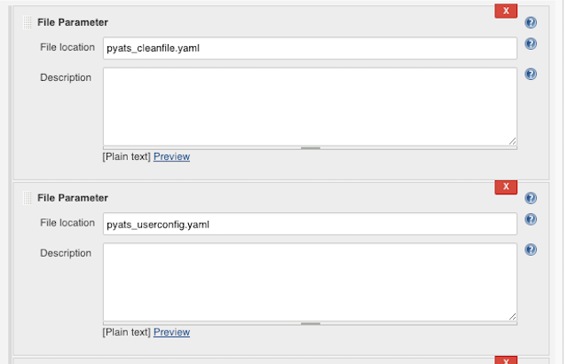

# Configuring Parameters

The project plugin allows Jenkins to encourage users to supply runtime job arguments, 
which overwrite the configuration parameters (predefined in job - configured in previous sections) 
at the time of each build. It is very useful when user run different sets of parameters for different 
builds but perfers to keep static default values for the job itself. 

Users do not need to create different jobs to simply hold different sets of parameters.

To enable the feature, on the job configuration page, enable the checkbox 
"This project is parameterized", and then add a parameter by selecting "Add Parameters".

There are six groups of pyATS parameters available for users to use:

* pyATS Parameter - Defines pyATS internal parameters. The parameters defined here will override the ones defined in "Execute pyATS Job" from "Add build step" component described in previous section.

* pyATS Flag Parameter - Defines pyATS flag parameters. The parameters defined here will override the ones (Boolean parameters) defined in "Execute pyATS Job" from "Add build step" component. Check the checkbox to send to _easypy_ as _-arg_; uncheck the box, the arguments won't be built for _easypy_.

* pyATS Custom Parameter - Defines pyATS user script parameters which are the key value pairs. These parameters are used in the pyATS scripts as user defined pass through arguments. The prefix ("--") has to be added in front of the variable name. For example: --abc

* pyATS Custom Flag Parameter - These parameters are used in the pyATS scripts as user defined pass through Boolean arguments. Check the checkbox to send to _easypy_ as _--arg_; uncheck the box, the arguments won't be built for _easypy_. The prefix ("--") has to be added in front of the variable name. For example: --abc

* pyATS Environment Parameter - This component allows users to set the pyATS virtual environment variables before executing any pyATS script. The variables are defined here will be set and exported to pyATS execution environment properly according to the running shell environment setup - _bash_ or _csh_.

* File Parameter - Plugin uses Jenkins native _File Parameter_ to pass two important files into pyATS jobs. These specific pyATS parameters are prefixed with  *pyats_*  and provide information on:
  * **pyats_cleanfile.yaml** - user can supply the pyATS clean file into the run instead of path of the file.
  * **pyats_userconfig.yaml** - user can supply the pyATS user config file into the run instead of using default pyATS system config.

When execute the build with parameters, user can dynamically change the parameter values for each run.

A parameter with a prefix "**-**" indicating it is a pyATS internal parameter (easypy argument). A parameter starts with "**--**" indicates that it is a pyATS script (pass though) parameter. A parameter within "**Env()**" indicates that it is a pyATS environment parameter.If any parameter has no prefix, it is a Jenkins native parameter.

By the end of the run, user can review the runtime parameters used in this build, and also can refer to parameter usage history to compare with the other builds.

