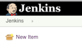
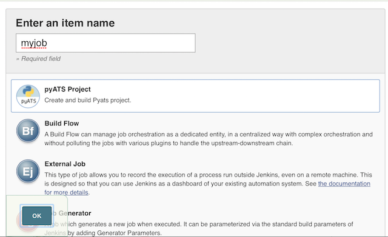
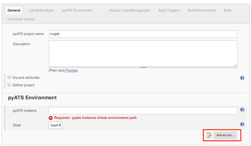
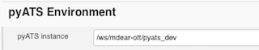
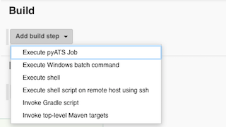
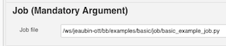
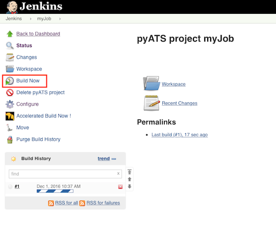
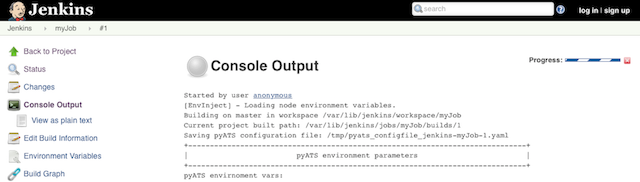

# Quick Start

## Creating a pyATS Project

### Step 1:

From the Jenkins home page, click "New Item" to bring the the Jenkins project creation page.

### Step 2:

Provide the project name then pick the project type **pyATS Project**

### Step 3:

Click "OK" to be redirected to the project configuration page.

### Step 4:
Configure the project mandatory parameter - pyATS instance (pyATS Virtual Env.). 

The provided pyATS instance needs to be accessible from your Jenkins build node (master or slave). When required information is not 
provided, or if the path provided is not valid, and error message will be displayed. A pyATS instance path is 
considered to be valid if the pyATS virtual environment source file (`bin/activate`) is present under the path specified (e.g.: path/bin/activate). Details on other configurable fields can be found in the __plugin components__ section below.

## Adding a Job as Build Step

### Step 1:

Select **Execute pyATS Job** from the list of build steps:

### Step 2:

Provide the full path to job file. 

The form validation will check if the job path is accessible from the current Jenkins running node (Master). 
A warning message is displayed if validation fails. The warning can be ignored in the following situations:
* The actual build happens on the remote/slave node which can access the job.
* pyATS job is in a _Docker_ environment.
* Jenkins parameter/variable is used here to present the job path.

Click the **Save** button to save the configuration.

## Execution and Output

To execute the job, click "Build Now" on the project page:

Runtime log can be viewed via native Jenkins "Console Output", or third party log viewer plugins user installed (Refer **Recommended Plugins** section).

