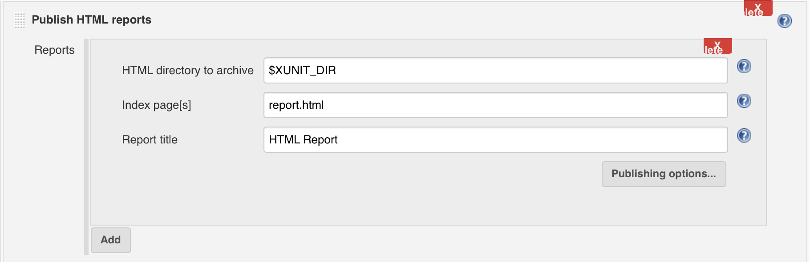

# Related Plugins

## pyATS Report Plugin

`It is mandatory to install the pyATS Report Plugin with the pyATS Project plugin to ensure uploading of the result of each build to Cisco Self Serve Services (S3) dashboard and/or Cisco ATS TRADe dashboard.`

The pyATS Report Plugin is a Post Build plugin that can display Cisco test automation results within Jenkins. The plugin extracts and parses the results archive (zip file) generated by Cisco test infrastructure such as Easypy (pyATS) and Autoeasy (tcl ATS) and displays the testcase results within Jenkins. It also provides the option to upload the result of each build to Cisco Self Serve Services (S3) dashboard and Cisco ATS TRADe dasboard.

For more details, refer to the **pyATS Jenkins Report Plugin User Guide**.

## Other Recommended Plugins

The following native Jenkins components and external plugins are tested with the pyATS project plugin. Jenkins will provide complete customized end-to-end solutions for cisco test community by selectively combining the following useful components/plugins with pyATS Project Plugin.

* Jenkins parameterized build component

This components allows user build the Jenkins job with parameters. This plugin should not be confused with the pyATS **runtime parameter** feature as they provide the way to generate pyTAS internal, pyATS script, and pyATS environment arguments only.  The "parameterized build component" plugin  provides a mechanism to supply arguments for Jenkins builds.

https://wiki.jenkins-ci.org/display/JENKINS/Parameterized+Build

* Jenkins Slave/Node component

This component makes the build distribution concurrently or sequentially execution possible.
https://wiki.jenkins-ci.org/display/JENKINS/Distributed+builds

To add new slave: From "Manage Jenkins" click "Manage Nodes" then "New Node".

Choose via SSH to launch the slave agent.

User can specify the execution server by enabling "Restrict where this project can be run" on job configuration page.

* Jenkins Execute shell

This component allows user to execute single or multiple shell scripts (python, groovy, et.) as a part of Jenkins build steps. User can leverage this component to define pyATS prebuild /postbuild steps and work with pyATS build step.

* Build Flow Plugin

This is a third party plugin that allows managing Jenkins jobs orchestration using a dedicated DSL, extracting the flow logic from jobs.

https://wiki.jenkins-ci.org/display/JENKINS/Build+Flow+Plugin

* Build Monitor Plugin

Third party plugin provides a highly visible view of the status of selected Jenkins jobs.

https://wiki.jenkins-ci.org/display/JENKINS/Build+Monitor+Plugin

* Build Graph View Plugin

Third party plugin computes a graph of related builds starting from the current one, and render it as a graph. 

https://wiki.jenkins-ci.org/display/JENKINS/Build+Graph+View+Plugin

* Lockable Resources Plugin

Third party plugin allows to define lockable resources (such as TESTBEDS, execution servers, etc.) that can be used by builds.

https://wiki.jenkins-ci.org/display/JENKINS/Lockable+Resources+Plugin

* EnvInject Plugin

Third party plugin makes it possible to have an isolated environment for the jobs.

https://wiki.jenkins-ci.org/display/JENKINS/EnvInject+Plugin

* Email-Ext Plugin

Third party plugin allows user to configure every aspect of email notifications. 

https://wiki.jenkins-ci.org/display/JENKINS/Email-ext+plugin

* HTML Publisher Plugin

Third party plugin publishes HTML reports. 
https://wiki.jenkins-ci.org/display/JENKINS/HTML+Publisher+Plugin

* JUnit Plugin

Third party plugin allows JUnit-format test results to be published. To make the pyATS Project Plugin generate xunit XML file, refer to section **Execute pyATS Job - xUnit directory** described above.

https://wiki.jenkins-ci.org/display/JENKINS/JUnit+Plugin

