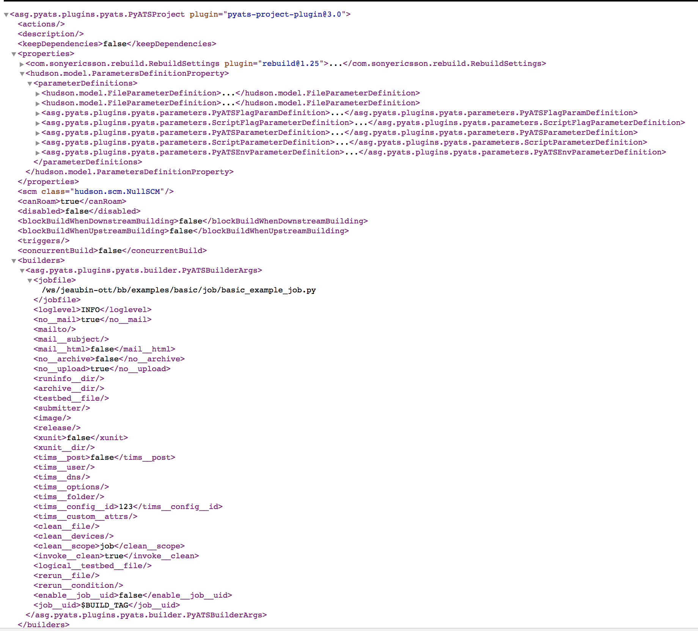

# REST API Support

The section describes how to use Jenkins REST APIs to create, configure, run, 
remove, and monitoring a pyATS project.

Create a pyATS Project with Mandatory Configuration

## POST JENKINS_URL/createItem?name= JOBNAME

Example: POST http://localhost:8080/createItem?name= myjob

Example of config.xml file that needs to be provided with REST to configure the job:

## POST JENKINS_URL/job/JOBNAME/build
Build a pyATS Job

Example: POST http://localhost:8080/job/myjob/build

## POST JENKINS_URL/job/JOBNAME/buildWithParameters?var=value
Build the pyATS Job with Parameters

Example: POST http://localhost:8080/job/myjob/buildWithParameters?mail_subject=test

* Removing a pyATS Project

## JENKINS_URL/job/JOBNAME/doDelete

Example: http://localhost:8080/job/myjob/doDelete

* Monitoring Current Build

## JENKINS_URL/job/JOBNAME/lastBuild/api/xml

Example: http://localhost:8080/job/myjob/lastBuild/api/xml